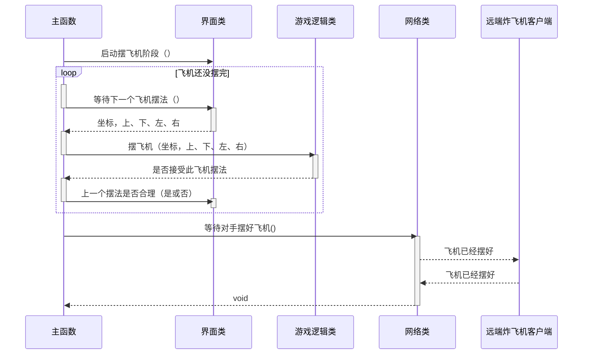

# 炸飞机

# 炸飞机游戏数据类
游戏中有两个机场，一个摆有自己飞机的机场，另一个用来记录炸对手机场的结果。
对手机场上飞机的摆法本方客户端是不可见的。
数据类包括：
存有3个飞机头+方向的AirplanePlace类(单例)
可实例化的“飞机头+方向”的Airplane类(非单例)
本方机场被炸的坐标集，BeBombed(单例)，用HashSet存一系列坐标点
敌方机场被炸的坐标集+状态，OpponentAirfield(单例)，用什么类型的数据结构还不知道

一些约定：
飞机原点坐标约定为左上角(0,0),x➡右增，y⬇下增
本方机场图像状态=飞机头坐标+方向+被炸的坐标集(分别在AirplanePlace和BeBombed类中。需要写算法计算具体状态，已经保证不会越界/重叠)
敌方机场状态=坐标+状态(都在OpponentAirfield类中)

## 摆飞机（坐标，上、下、左、右）：
怎么用?
实例化一个游戏逻辑类对象(GameLogic类)，不断调用其中的方法setAirplane(int x,int y,String d),
若传入成功，返回bool类型的true，若传入不成功，则可能是(飞机机头/机身坐标越界、重叠)，需要提示用户，返回false
里面的算法逻辑：
1、机头/机身坐标是否越界
2、获取已有飞机坐标，判断是否有飞机坐标重叠
返回bool值

```c#
public class Coordinate
{
    public int X;
    public int Y;

    public Coordinate(int x, int y);

    public static Coordinate Void();
}
```

## 本方机场挨炸（坐标）：返回炸的结果，未炸中、炸中了机身、炸中了机头。

炸的结果使用 C# 枚举类。

```c#
public enum BombResult
{
    Miss,
    Hit,
    Destroyed
}
```

## 登记炸对方机场的结果（坐标，炸的结果）：炸的结果同上条。

## 游戏结束了吗（）：如果有一方被炸中机头的次数等于摆有的飞机数则这一方输，另一方赢，游戏结束。

## 现在的状态（）：供读者读取游戏状态，具体表示见下文。

## 游戏状态的表示

- 飞机摆法列表：一个列表，里面各元素记录有机头坐标和飞机朝向。
- 系统猜想的敌方飞机的摆法：一个列表，里面各元素记录有机头坐标和飞机朝向。
- 本方机场挨炸：一个列表，装有挨炸位置的坐标。
- 我方炸对方机场得到的结果：一个列表，里面各元素记录有坐标和炸的结果。

## 实现细节设计

使用单例模式来保证只有一个实例。

# 网络模块

## 等待类操作的异常事件处理方法

### 网络超时

### 对方玩家操作超时

## 加入对方房间并等待和对手握手（IP 地址）：我方是否先手

## 创建房间（）：IP 地址

## 等待对手加入（）：我方是否先手

## 等待对手摆好飞机（）

阻塞，直到远端客户端发来飞机已经摆好的信息。可能会等很久，对手要摆完他的飞机。

## 炸对方的机场并返回炸的结果（坐标）：炸的结果

## 等待对方来炸我方机场（）：坐标

## 非功能性方法，善后（）

阻塞，等待对方回传。

## 发回我方机场挨炸的结果（炸的结果）

## 是否远端已经断开连接（）：是或否

# 交互界面模块

## 绘制其他内容（其他内容）

- 聊天信息
- 开发调试信息
- 通知消息
    - 对手的 IP 地址是……、对手已加入房间
    - 对手正在摆飞机
    - 对手正在选定要炸的位置
    - 对手已经离线

## 绘制游戏数据状态（游戏数据类实例）

## 等待本回合用户要炸的对方机场的坐标（）：坐标

阻塞，最多等待 30 秒，如果用户没有输入就返回 `(-1,-1)`。

## 等待下一个飞机摆法（）：坐标，上、下、左、右

阻塞，返回格式见前述游戏数据类部分。

## 等待获取一个 IP 地址（）：IP 地址

阻塞，如果用户希望创建房间的话就返回空字符串。

# 人工智能模块

## 本回合要炸的对方机场的坐标（游戏数据类实例）:坐标

# 游戏流程

## 游戏各子系统初始化


## 在线游戏功能初始化


## 游戏准备阶段



## 炸飞机阶段

### 我方等待对手来炸


### 我炸对方机场


